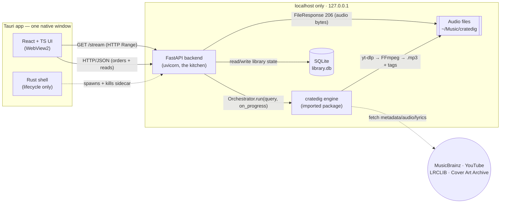
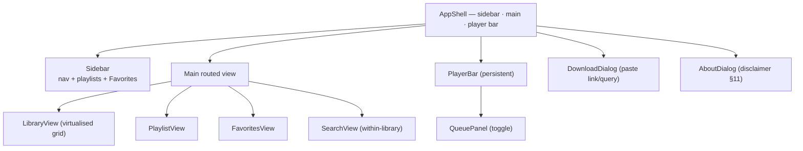

# `cratedig-desktop` — Native Music Library & Player · Technical Design & Build Plan

> **Status:** Draft spec, v0.1 — *no application code written yet. Awaiting approval.*
> **Purpose:** complete architecture spec + phased build roadmap. Reviewed/approved first, then
> handed to Claude Code one phase at a time. This is the **single source of truth**.
> **Working name:** `cratedig-desktop`. Installable Windows-first desktop app; product name TBD (§10).
> **Relationship to `cratedig`:** this app is a *front-end + library manager* wrapped around the
> existing **`cratedig`** engine (github.com/pchrysostomou/cratedig). `cratedig` stays **UNCHANGED**
> and is consumed as a dependency. Its `DESIGN.md` remains the source of truth for the *engine*;
> this document owns the *desktop app* around it.

---

## 0. Legal / scope note (read first)

`cratedig-desktop` does not download anything itself — it drives `cratedig`, which fetches metadata
from MusicBrainz (free, keyless), downloads matching audio from YouTube via `yt-dlp`, and fetches
lyrics from LRCLIB. The download step sits in the **same legal gray area** as the upstream engine
(and as `spotDL` / `yt-dlp`). Use it only for content you have the right to use. The **same
disclaimer as `cratedig`** is carried over and shown in an **About** screen (§11).

`cratedig` is **GPL-3.0-or-later**. Because we *import* it, the whole app is a GPL derivative:
`cratedig-desktop` is therefore also **GPL-3.0-or-later**, © Prodromos Chrysostomou (§11). `cratedig`
is the **same author's own project**, so this simply keeps one body of work consistently GPL — fine
for personal + portfolio use.

**Input scope (important, see §10 Q1):** the user "pastes a link or a search query." `cratedig`
accepts a **MusicBrainz release/recording URL or MBID, or a free-text `"Artist - Title"` search** —
*not* an arbitrary YouTube/Spotify URL. v1 passes the user's input straight to `cratedig`; a
"resolve any link → search query" layer is out of scope for v1 and called out as an open question.

---

## 1. Overview & the "restaurant" architecture

Think of the app as a restaurant with a strict separation of roles:

| Role | Component | Responsibility |
|---|---|---|
| **Front of house** (waiter) | **React + TS UI** | Takes the order, shows the menu (library), plays music. **Never cooks.** Talks only to the kitchen over HTTP. |
| **Kitchen** (head chef) | **FastAPI backend** | Owns everything. Receives orders, runs the engine, records state, plates the food (serves audio). The *only* component that touches the engine or the database. |
| **The appliance** (the oven) | **`cratedig` engine** | Does the actual cooking: metadata → match → download → transcode → tag. Imported, unchanged. |
| **The pantry / ledger** | **SQLite** | What's in stock (tracks), the recipe cards (playlists), favourites, the current queue, the order history. |
| **The building** (premises + utilities) | **Tauri (Rust) shell** | The native window and installer. Starts the kitchen (spawns the Python sidecar) when the app opens and shuts it down when it closes. |

**Separation of concerns (non-negotiable):**
- The **UI never downloads, never touches files, never opens the database, never imports `cratedig`.**
  It issues HTTP requests and renders responses.
- The **backend owns `cratedig` + SQLite + the audio files.** It is the single writer of state.
- The **Rust shell owns process lifecycle only** — it launches and kills the backend; it does not
  contain business logic.



---

## 2. Tech stack & rationale

| Concern | Choice | Why |
|---|---|---|
| Desktop shell | **Tauri v2** (Rust) | Native installer + small footprint; WebView2 on Windows. Ships the React build and spawns the Python sidecar. |
| UI | **React 18 + TypeScript + Vite** | Component model for sidebar/grid/player; Vite for fast dev + a static build Tauri bundles. |
| Client state | **Zustand** | Player/queue state. Selector subscriptions stop high-frequency `timeupdate` ticks from re-rendering the whole app. |
| Server cache | **TanStack Query v5** | Library/playlist/search reads — caching, dedupe, and `refetchInterval` polling for download-job status. |
| Audio engine | **Native HTML5 `<audio>`** | Built-in HTTP byte-range streaming + every event we need (`ended`, `timeupdate`, `seeked`…). Howler.js is stale (v2.2.4, 2023) and buggy in the `html5:true` mode we'd be forced into. |
| Backend | **FastAPI + uvicorn** | Async local HTTP bridge; serves JSON and audio (with Range). |
| Engine | **`cratedig`** (imported) | The download + tag pipeline. UNCHANGED (§2 of its DESIGN; this doc §3). |
| State store | **SQLite via SQLModel** | One file; SQLModel = SQLAlchemy + Pydantic v2, and Pydantic v2 is already in the tree via `cratedig`. (Plain stdlib `sqlite3` + a repository layer is the minimal alternative.) |
| Audio streaming | **Starlette `FileResponse`** (≥0.39) | Returns **206 Partial Content** for `Range` requests automatically → the seek bar "just works." |
| Audio transcode | **FFmpeg** (system-first, bundled fallback) | Required by `yt-dlp`/`cratedig`. Use a system FFmpeg if present; otherwise fall back to a bundled copy put on `PATH` — zero-setup without wasting space for users who already have it (§3.3, §8.2, §10 Q3). |
| Packaging | **PyInstaller** (onedir) + **Tauri bundler** (NSIS/MSI) | Freeze the backend to a sidecar; Tauri builds the Windows installer. |

---

## 3. Consuming `cratedig` (the engine)

### 3.1 As a dependency — no source duplication

`cratedig` is declared in the **backend's** `backend/pyproject.toml`. We do **not** copy, vendor, or
fork any of its source. Its own runtime deps (`yt-dlp`, `mutagen`, `pydantic`, `requests`,
`rapidfuzz`, …) come in **transitively** — we never re-declare them.

```toml
# backend/pyproject.toml  (excerpt)
[project]
name = "cratedig-desktop-backend"
requires-python = ">=3.10"
dependencies = [
    "fastapi>=0.115",
    "uvicorn[standard]>=0.30",
    "sqlmodel>=0.0.22",
    # The engine. Git dependency until cratedig is published to PyPI:
    "cratedig @ git+https://github.com/pchrysostomou/cratedig.git@v0.1.0",
    # When published, this becomes simply:
    #   "cratedig>=0.1.0"
]
```

> **Confirmation:** no `cratedig` source is duplicated. We import the installed package; pinning to
> the `@v0.1.0` tag keeps builds reproducible. FFmpeg is still **not** a pip dependency (§8).

### 3.2 The adapter — mirroring `crate download`, exactly

The backend wires up `cratedig`'s injected collaborators the **same way its `cli.py` does**, and
calls `Orchestrator.run(query, on_progress=…)`. The `on_progress(done, total)` callback is
`cratedig`'s built-in progress hook — we forward it straight into our job registry (§5). Nothing in
`cratedig` is modified.

```python
# backend/app/engine.py — thin adapter over cratedig (UNCHANGED engine)
from yt_dlp import YoutubeDL
from cratedig.config import get_settings
from cratedig.core.orchestrator import Orchestrator
from cratedig.download.matcher import rank_candidates
from cratedig.download.youtube_downloader import YouTubeDownloader
from cratedig.lyrics.lyrics_fetcher import fetch_lyrics
from cratedig.providers.musicbrainz_handler import MusicBrainzHandler
from cratedig.tagging.tagger import Tagger
from cratedig.models import DownloadResult  # the data contract we persist

def run_download(query: str, *, output_dir, cookies_from_browser=None,
                 no_lyrics=False, on_progress=None) -> list[DownloadResult]:
    settings = get_settings(output_dir=output_dir, cookies_from_browser=cookies_from_browser)
    orchestrator = Orchestrator(
        handler=MusicBrainzHandler(),
        downloader=YouTubeDownloader(
            settings.output_dir,
            audio_format=settings.audio_format,
            bitrate=settings.bitrate,
            cookies_from_browser=settings.cookies_from_browser,
        ),
        ranker=rank_candidates,
        lyrics_fetcher=None if no_lyrics else fetch_lyrics,
        tagger=Tagger(),
        ydl=YoutubeDL({"quiet": True, "no_warnings": True, "ignoreerrors": True}),
        max_workers=settings.max_workers,
    )
    return orchestrator.run(query, on_progress=on_progress)
```

Each returned `DownloadResult` carries `.track` (a `cratedig` `Track`), `.status`
(`success`/`skipped`/`not_found`/`failed`), `.output_path` (the local audio file we serve),
`.youtube_url`, `.lyrics_found`, and `.error`. The backend maps these into the `tracks` table (§6).

### 3.3 FFmpeg — system-first, bundled fallback (without touching `cratedig`)

`cratedig`'s `YouTubeDownloader` resolves FFmpeg **only** via `shutil.which("ffmpeg")` — it does not
accept an `ffmpeg_location`. So the seam is **`PATH`**: we ensure a working FFmpeg is on `PATH`
before any `cratedig` call, and its existing `which("ffmpeg")` guard passes unchanged.

We use a **hybrid resolution order** at sidecar startup (§10 Q3):
1. **System first** — if `shutil.which("ffmpeg")` already finds one, use it and add **nothing** to
   `PATH`. Users who already have FFmpeg pay no cost.
2. **Bundled fallback** — only if no system FFmpeg is found, prepend the app's bundled FFmpeg
   directory to `PATH`, giving zero-setup for users without it.

```python
# backend/app/server.py (frozen entrypoint) — runs before any cratedig call does work
import os, sys, shutil
if shutil.which("ffmpeg") is None:                                   # 1) prefer system FFmpeg
    base = getattr(sys, "_MEIPASS", os.path.dirname(sys.executable)) # PyInstaller bundle dir
    bundled = os.path.join(base, "ffmpeg")                           # where the spec puts it (§8.2)
    if os.path.isdir(bundled):                                       # 2) fall back to bundled copy
        os.environ["PATH"] = bundled + os.pathsep + os.environ.get("PATH", "")
```

This keeps `cratedig` untouched, costs nothing for users who already have FFmpeg, and still works
out-of-the-box for those who don't. The bundled build is a license-compatible (GPL/LGPL) FFmpeg,
documented in About / `LICENSE` (§11).

---

## 4. Repository structure (monorepo)

```
cratedig-desktop/
├── DESIGN.md                      # this document (single source of truth)
├── CLAUDE.md                      # working agreement (mirrors cratedig's)
├── README.md
├── LICENSE                        # GPL-3.0-or-later (inherited via cratedig)
├── package.json                   # frontend + tauri scripts
├── index.html · vite.config.ts · tsconfig.json
│
├── src/                           # ── React + TS frontend ──
│   ├── app/                       # root, providers (QueryClientProvider, Router)
│   ├── api/                       # typed FastAPI client + endpoint fns + generated types
│   ├── audio/                     # <audio> singleton + useAudioEngine + preload-next
│   ├── features/
│   │   ├── player/                # PlayerBar, ProgressBar, VolumeControl, playerStore
│   │   ├── queue/                 # QueuePanel, queueStore
│   │   ├── library/               # LibraryGrid, TrackRow, useTracks
│   │   ├── playlists/             # PlaylistView, Sidebar list, usePlaylists
│   │   ├── search/                # SearchBar, SearchResults, useSearch
│   │   └── download/              # DownloadDialog, useDownloadJob (polls /jobs)
│   ├── components/ui/             # Button, Slider, Icon, ...
│   ├── lib/                       # formatTime, utils
│   └── types.ts
│
├── backend/                       # ── FastAPI Python backend ──
│   ├── pyproject.toml             # deps incl. the cratedig git/PyPI dependency
│   ├── app/
│   │   ├── main.py                # FastAPI app, CORS, routers, /health
│   │   ├── server.py              # frozen entrypoint: PATH/ffmpeg, then uvicorn.run
│   │   ├── db.py                  # SQLite/SQLModel engine + schema init/migrations
│   │   ├── models.py              # SQLModel tables (§6)
│   │   ├── schemas.py             # request/response Pydantic models
│   │   ├── engine.py              # the cratedig adapter (§3.2)
│   │   ├── jobs.py                # async download-job registry + progress
│   │   ├── repositories/          # data access (tracks, playlists, queue, ...)
│   │   └── routers/               # download, library, playlists, favorites, queue, stream, settings
│   ├── vendor/ffmpeg.exe · ffprobe.exe   # bundled at build time
│   └── cratedig-sidecar.spec      # PyInstaller spec (mirrors cratedig.spec + uvicorn + ffmpeg)
│
└── src-tauri/                     # ── Tauri (Rust) shell ──
    ├── tauri.conf.json            # bundle.resources / externalBin, identifier, window
    ├── Cargo.toml                 # tauri, tauri-plugin-shell
    ├── capabilities/default.json  # shell:allow-spawn ... { sidecar: true }
    ├── binaries/                  # (strategy A) cratedig-sidecar-<triple>.exe
    └── src/lib.rs                 # spawn sidecar in setup(); kill the tree on exit
```

---

## 5. Backend API design (FastAPI)

All endpoints are served on `http://127.0.0.1:<port>` (default **8008**, §8). JSON in/out except
`/stream` and `/cover`, which return bytes. `Track` in responses is the DB row (§6) enriched with
`is_favorite` and `playlist_ids`.

### 5.1 Endpoint catalogue

**Health & meta**

| Method | Path | Request | Response | Notes |
|---|---|---|---|---|
| GET | `/health` | — | `{status:"ok", version}` | **Readiness probe** — Rust/React poll this before showing the UI (§8). |
| GET | `/about` | — | `{disclaimer, license, versions:{app,cratedig,ytdlp}}` | Feeds the About screen (§11). |
| GET | `/settings` · PUT `/settings` | settings JSON | settings JSON | output dir, default format/bitrate, cookies browser, no-lyrics default. |

**Downloads (long-running)**

| Method | Path | Request | Response | Notes |
|---|---|---|---|---|
| **POST** | `/download` | `{query, format?, bitrate?, cookies_from_browser?, no_lyrics?}` | **`202 {job_id}`** | **Long-running.** Starts a `cratedig` run; returns immediately. |
| GET | `/jobs/{job_id}` | — | `{id, query, status, done, total, tracks:[...], error?}` | **Poll** for progress (§5.2). |
| GET | `/jobs` | `?active=true` | `[job summary]` | Recent/active jobs (for a downloads panel). |
| DELETE | `/jobs/{job_id}` | — | `204` | Cancel/dismiss a job. |

**Library**

| Method | Path | Request | Response | Notes |
|---|---|---|---|---|
| GET | `/library` | `?q=&sort=&order=&limit=&offset=` | `[Track]` | The grid. **`q` = search-within-library** (title/artist/album, SQL `LIKE`/FTS). |
| GET | `/tracks/{id}` | — | `Track` (+ `is_favorite`, `playlist_ids`, `lyrics`) | Track detail. |
| DELETE | `/tracks/{id}` | `?delete_file=false` | `204` | Remove from library; optionally delete the audio file. |
| **GET** | **`/stream/{id}`** | `Range` header | **audio bytes (`FileResponse`, 206)** | Serves the local file to the player; seeking works for free. |
| GET | `/cover/{id}` | — | image bytes | Album art (cached local file, else proxied from `cover_art_url`). |

**Playlists (CRUD + ordering)**

| Method | Path | Request | Response | Notes |
|---|---|---|---|---|
| GET | `/playlists` | — | `[Playlist]` | Sidebar list. |
| POST | `/playlists` | `{name, description?}` | `201 Playlist` | |
| GET | `/playlists/{id}` | — | `{playlist, tracks:[Track]}` | Ordered tracks. |
| PATCH | `/playlists/{id}` | `{name?, description?}` | `Playlist` | Rename / edit. |
| DELETE | `/playlists/{id}` | — | `204` | |
| POST | `/playlists/{id}/tracks` | `{track_id, position?}` | `201` | Add (append or insert). |
| DELETE | `/playlists/{id}/tracks/{track_id}` | — | `204` | Remove. |
| PUT | `/playlists/{id}/order` | `{ordered_track_ids:[...]}` | `200` | Reorder (drag-and-drop). |

**Favorites**

| Method | Path | Request | Response | Notes |
|---|---|---|---|---|
| GET | `/favorites` | — | `[Track]` | The "Liked Songs" view. |
| PUT | `/favorites/{track_id}` | — | `204` | Add (idempotent). |
| DELETE | `/favorites/{track_id}` | — | `204` | Remove. |

**Queue & player state** (persisted so playback survives a restart)

| Method | Path | Request | Response | Notes |
|---|---|---|---|---|
| GET | `/queue` | — | `{items:[Track], current_index, shuffle, repeat}` | |
| PUT | `/queue` | `{track_ids:[...], current_index?}` | `200` | Replace the whole queue (e.g. "play this playlist"). |
| POST | `/queue/tracks` | `{track_id, position?}` | `201` | Enqueue / "play next." |
| DELETE | `/queue/tracks/{position}` | — | `204` | Remove one. |
| PUT | `/player-state` | `{current_index?, shuffle?, repeat?, volume?, position_ms?}` | `200` | Persist player UI state. |
| GET | `/player-state` | — | player state | Restore on launch. |

**History**

| Method | Path | Request | Response | Notes |
|---|---|---|---|---|
| POST | `/history` | `{track_id, ms_played?}` | `201` | Record a play (also bumps `tracks.play_count`). |
| GET | `/history` | `?limit=` | `[{track, played_at}]` | Recently played. |

### 5.2 Long-running downloads & progress — **polling, not WebSockets**

A `cratedig` run is blocking (its `Orchestrator` uses a `ThreadPoolExecutor` internally) and can
take many seconds to minutes for an album. So:

1. `POST /download` registers a job in an in-process registry (`jobs.py`) **and** a `download_jobs`
   row (§6), then launches the work off the event loop via `asyncio.to_thread(run_download, …)` so
   uvicorn stays responsive.
2. `cratedig`'s `on_progress(done, total)` callback updates the job's `done`/`total` as each track
   completes.
3. The UI polls `GET /jobs/{job_id}` (TanStack Query `refetchInterval`, ~750 ms while `status` is
   `running`, stop on terminal status).

**Recommendation: polling.** Justification — progress is *coarse* (per-track `done/total`, not byte
streams) and *nice-to-have*; one or few jobs run at a time; polling a localhost endpoint is trivially
cheap and has none of WebSocket's connection-lifecycle, reconnect, or sidecar-restart edge cases. A
WebSocket buys real-time push we don't need and costs complexity we'd rather not carry through the
Tauri packaging boundary. (If live per-byte progress ever matters, a single `/jobs/{id}/events` SSE
endpoint is the smaller upgrade — still no bidirectional socket.)

### 5.3 CORS

The WebView origin differs by platform (`http://tauri.localhost` on Windows WebView2,
`tauri://localhost` on macOS). The backend binds to `127.0.0.1` only, so we add `CORSMiddleware`
allowing the Tauri origins (and `http://localhost:1420` for the Vite dev server). Because the server
is loopback-only and unauthenticated, an `allow_origins=["*"]` is acceptable for v1; we prefer the
explicit Tauri/Vite origin list.

---

## 6. SQLite schema

One file, `library.db`, in the app's data dir (`%APPDATA%/cratedig-desktop/`). Columns map directly
from `cratedig`'s `Track`/`DownloadResult` contract (§3.2). `artists` is stored as a JSON array
(matching `Track.artists: list[str]`); `primary_artist` is denormalised for cheap sort/display.
Timestamps are epoch-millis integers. Foreign keys `ON DELETE CASCADE` so deleting a track cleans up
its playlist/queue/favorite/history rows. `play_count`/`last_played_at` are maintained by `/history`.

```mermaid
erDiagram
    tracks ||--o{ playlist_tracks : "appears in"
    playlists ||--o{ playlist_tracks : "contains"
    tracks ||--o| favorites : "starred"
    tracks ||--o{ queue : "queued"
    tracks ||--o{ play_history : "played"

    tracks {
        integer id PK
        text    source_id "MusicBrainz MBID (from cratedig)"
        text    title
        text    artists "JSON array<string>"
        text    primary_artist "denormalised for sort"
        text    album
        text    isrc
        integer duration_ms
        integer track_number
        integer disc_number
        text    release_year
        text    cover_art_url "remote (Cover Art Archive)"
        text    cover_path "local cached art, nullable"
        text    lyrics "embedded copy, nullable"
        text    file_path UK "DownloadResult.output_path"
        text    file_format "mp3 / m4a / opus ..."
        integer file_size
        text    youtube_url "DownloadResult.youtube_url"
        integer play_count "default 0"
        integer added_at
        integer last_played_at "nullable"
    }
    playlists {
        integer id PK
        text    name
        text    description "nullable"
        integer created_at
        integer updated_at
    }
    playlist_tracks {
        integer id PK
        integer playlist_id FK
        integer track_id FK
        integer position "order within playlist"
        integer added_at
    }
    favorites {
        integer track_id PK_FK "one row per liked track"
        integer created_at
    }
    queue {
        integer id PK
        integer position "play order"
        integer track_id FK
    }
    play_history {
        integer id PK
        integer track_id FK
        integer played_at
        integer ms_played "nullable"
    }
    player_state {
        integer id PK "singleton row, id = 1"
        integer current_index
        integer is_playing
        text    repeat_mode "off | all | one"
        integer shuffle "0 / 1"
        integer volume "0-100"
        integer position_ms
    }
    download_jobs {
        text    id PK "uuid"
        text    query
        text    status "queued | running | done | error"
        integer total
        integer done
        text    error "nullable"
        integer created_at
        integer finished_at "nullable"
    }
```

Notes:
- **`player_state`** is a singleton (always `id = 1`) holding shuffle/repeat/volume/position so the
  app reopens exactly where you left off.
- **`download_jobs`** persists job status so `GET /jobs` survives a backend restart.
- **Dedup:** a downloaded `file_path` is `UNIQUE`; re-downloading an existing track is a no-op
  (matches `cratedig`'s idempotent, deterministic filenames). `source_id` is indexed for "already
  have it?" checks. Whether a playlist may contain the *same* track twice is an open question (§10 Q6);
  v1 keeps `UNIQUE(playlist_id, track_id)`.

---

## 7. Frontend structure (React / TypeScript)

### 7.1 Views & components



- **AppShell** — three-pane layout (Spotify-like): left **Sidebar** (Library / Search / Favorites +
  playlist list), routed **Main**, and a persistent **PlayerBar**.
- **LibraryView** — virtualised grid/table (react-virtuoso) over `GET /library`; columns title /
  artist / album / duration; row actions (play, queue, favourite, add-to-playlist).
- **PlaylistView / FavoritesView** — same row component; drag-to-reorder calls `PUT /playlists/{id}/order`.
- **SearchView** — search-*within-library* (`/library?q=`). The **DownloadDialog** is where you
  bring *new* music in, which POSTs `/download`.
- **DownloadDialog** — honest input copy (§10 Q1): **"Paste a MusicBrainz link or search
  `Artist - Title`."** Submits the query, then shows a progress row driven by `useDownloadJob`
  (polls `/jobs/{id}`); on completion it invalidates the library query so new tracks appear.
  Arbitrary YouTube/Spotify links are **not** accepted in v1.
- **PlayerBar** — now-playing, transport (play/pause/prev/next), seek bar, volume, shuffle/repeat,
  queue toggle.
- **AboutDialog** — carries the legal disclaimer (§11).

### 7.2 State management — Zustand + TanStack Query

Clear split (recommended, and verified current best practice):
- **TanStack Query v5** owns *server* state: `useTracks`, `usePlaylist`, `useSearch`, `useDownloadJob`.
  Caching, dedupe, background refetch, and `refetchInterval` polling for jobs — for free. Writes use
  `useMutation` + `queryClient.invalidateQueries`.
- **Zustand** owns *client/ephemeral* state in two slices: **playerStore** (status, volume, muted,
  `currentTrackId`, shuffle, repeat) and **queueStore** (items, `currentIndex`, history). Selector
  subscriptions (`useStore(s => s.isPlaying)`) keep re-renders narrow.
- **The `<audio>` element is the source of truth** for `currentTime`/`duration`/`buffered`; only what
  the UI needs is mirrored into Zustand. The element is **not** stored in React state.

### 7.3 The player — native HTML5 `<audio>`

- One long-lived `<audio>` owned by a **`useAudioEngine`** hook (module singleton). `src` is
  `http://127.0.0.1:<port>/stream/{id}`. Seeking works because the backend serves **206 Partial
  Content** (§5.1, §8).
- **Queue advance:** the `ended` event triggers "next" against `queueStore` (respecting repeat/shuffle).
- **Gapless-ish:** preload the next queue item in a second hidden `<audio preload="auto">` and swap
  on `ended`. (True sample-accurate gapless needs Web Audio + fully-decoded buffers — out of scope;
  a tens-of-ms gap is acceptable.)
- **Perf:** drive the seek-bar fill from the `timeupdate` event via a ref/DOM write (or a single
  narrowly-subscribed progress component) — never push `currentTime` into Context, which would
  re-render every consumer at up to ~66 Hz.
- **Robustness:** `audio.play()` returns a rejectable Promise (autoplay policy / racing `load()`);
  always `.catch()` and guard against rapid track switches.

---

## 8. Tauri integration & packaging (the trickiest part — honestly)

This is the hardest piece: Tauri ships a **Rust binary + web UI**, but we also need a **Python
process**. The Python backend is frozen to an executable and run as a **sidecar**.

### 8.1 Dev vs. production

- **Dev:** `beforeDevCommand` runs Vite (`http://localhost:1420`); the backend runs as **plain
  Python** (`uvicorn app.main:app --reload --port 8008`) — *not* frozen. Fast iteration; the UI
  fetches `127.0.0.1:8008`.
- **Production:** the backend is **PyInstaller-frozen**; the Rust shell spawns it; React is served
  from the bundled assets. Same HTTP contract as dev.

### 8.2 Freezing the backend (PyInstaller) — onedir, mirroring `cratedig.spec`

`cratedig.spec` already proves the pattern (`collect_all('yt_dlp')`+`certifi`, `--onedir`, UPX off,
AV-aware excludes). The backend's `cratedig-sidecar.spec` extends it:

- **Force-collect the dynamic importers** PyInstaller can't see statically:
  `collect_submodules('uvicorn')` (loops/protocols/lifespan), `collect_all('pydantic')` +
  `collect_all('pydantic_core')` (the native `.pyd`), `collect_submodules('starlette')`,
  `collect_submodules('anyio')`, `collect_submodules('yt_dlp')`, and `collect_submodules('cratedig')`.
- **Install `cratedig` into the build venv first** — PyInstaller freezes whatever is importable
  (`pip install`, then build).
- **Bundle FFmpeg as a fallback** into an `ffmpeg/` subfolder
  (`('vendor/ffmpeg.exe','ffmpeg')`, `('vendor/ffprobe.exe','ffmpeg')`) — used only when no system
  FFmpeg is on `PATH` (system-first, §3.3). Note the Windows `--add-binary` separator is `;`.
  Document the bundled build's license (a GPL/LGPL-compatible FFmpeg) in About / `LICENSE` (§11).
- **`console=True`** so Tauri can capture uvicorn's stdout/stderr (`--windowed` would suppress them).

**onedir vs. onefile — the real tension.** A `--onefile` exe is the textbook sidecar shape (a single
file), but with our payload (FFmpeg + yt-dlp + pydantic native libs ≈ 80–150 MB) it **re-extracts to
`%TEMP%` on every launch** → multi-second cold start, strong Windows Defender / SmartScreen
false-positive signature, and a known break of uvicorn signal handling. `--onedir` starts fast and is
AV-friendly — but it's a *folder*, which doesn't drop neatly into Tauri's single-file `externalBin`.
Two strategies:

| | **A — `externalBin` + onefile** (bootstrap) | **B — `bundle.resources` + onedir** (production) |
|---|---|---|
| Layout | one `cratedig-sidecar-<triple>.exe` in `src-tauri/binaries/` | the onedir folder shipped under `bundle.resources` |
| Launch | `app.shell().sidecar("cratedig-sidecar").spawn()` | resolve `app.path().resource_dir()`, then `tauri-plugin-shell` `Command::new(<path-to-exe>).spawn()` |
| Pros | simplest; matches Tauri docs exactly | fast startup, fewer AV flags (matches `cratedig`'s own onedir choice) |
| Cons | slow cold start, AV friction, signal-handling bug | more wiring (resolve resource path + a path-scoped capability) |

**Recommendation:** build end-to-end with **A** in Phase 6 (get it working), then switch to **B**
before release. Be honest in the release notes about AV behaviour either way.

### 8.3 Spawning, readiness, and lifecycle (Tauri v2 specifics — verified)

- **Config:** `tauri.conf.json` → `bundle.externalBin: ["binaries/cratedig-sidecar"]` (bare path, no
  ext/triple). The on-disk file **must** carry the target-triple suffix —
  `cratedig-sidecar-x86_64-pc-windows-msvc.exe`. Find the triple with `rustc --print host-tuple`; a
  build step renames the PyInstaller output. (Strategy B uses `bundle.resources` instead.)
- **Permissions (v2 capabilities, not v1 allowlist):** install `tauri-plugin-shell` (Rust) +
  `@tauri-apps/plugin-shell` (JS); in `capabilities/default.json` grant **`shell:allow-spawn`** with
  `allow: [{ name: "binaries/cratedig-sidecar", sidecar: true }]` (we `.spawn()` and stream stdout).
- **Spawn in Rust `setup()`** and **store the `CommandChild`** in managed state. Note the API
  asymmetry: Rust `app.shell().sidecar("cratedig-sidecar")` takes the **bare name**; JS
  `Command.sidecar("binaries/cratedig-sidecar")` takes the **full config path**.
- **Readiness race:** spawning ≠ listening. React shows a splash and **polls `GET /health`** (retry
  loop) before rendering; only then is the app interactive.
- **Lifecycle / zombie processes (the big gotcha):** Tauri v2 does **not** reliably kill the sidecar
  on exit. We capture the child and `child.kill()` on `RunEvent::ExitRequested` /
  `WindowEvent::Destroyed`. Because `child.kill()` does **not** reap *grandchildren* (the yt-dlp /
  FFmpeg subprocesses `cratedig` spawns), we kill the **whole process tree** —
  `taskkill /PID <pid> /T /F` on Windows (or the `sysinfo` crate). Otherwise a crash can leave an
  orphaned backend holding port 8008.
- **Port:** start with a fixed `127.0.0.1:8008`. If collisions become real, upgrade to a handshake —
  Python binds `:0`, prints the chosen port on stdout, Rust reads it from the `CommandEvent::Stdout`
  stream and forwards it to the frontend via an emitted event.
- **UTF-8:** set `PYTHONUTF8=1` / `PYTHONIOENCODING=utf-8` (in the Rust `.env()` and/or `server.py`)
  so non-ASCII track titles don't crash the frozen process on Windows.

---

## 9. Phased build plan (one phase per prompt → one PR per phase)

Each phase is small, independently testable, and **live-tested** before it's called done (per the
working agreement, §12).

| Phase | Deliverable | Done when |
|---|---|---|
| **0 — Scaffold** | Monorepo (`src/`, `backend/`, `src-tauri/`); `backend/pyproject.toml` with the `cratedig` git dep; FastAPI app with `/health`; SQLite init; Vite+React+TS shell. | `uvicorn` serves `/health`; `npm run dev` shows the shell; `import cratedig` works in the backend venv. |
| **1 — Backend + DB skeleton** | Full SQLite schema (§6) + SQLModel models + repositories; read endpoints `/library`, `/tracks/{id}`. | CRUD against a seeded DB via `curl`/tests; schema matches §6. |
| **2 — Download wired to `cratedig`** | `/download` → job registry → `engine.run_download` with `on_progress`; persist resulting `tracks`; `/jobs/{id}` polling. | Paste a query → file lands in the library dir → a `tracks` row appears → `/jobs/{id}` shows `done/total`. |
| **3 — React UI shell** | Sidebar + virtualised `LibraryView` + routing; TanStack Query wired to `/library`, `/tracks`. | Downloaded tracks render in the grid; navigation works. |
| **4 — Library + player** | `/stream/{id}` (`FileResponse` 206) + `/cover/{id}`; `useAudioEngine` + `PlayerBar`; play/pause/seek/volume; `ended`→next; `/history`; **backfill `duration_ms` via mutagen/ffprobe when it is 0** (cratedig untouched — covers MusicBrainz "no length" matches, e.g. the Phase 2 "Get Lucky" download). | Click a track → it plays **and seeks**; queue auto-advances; play count increments. |
| **5 — Playlists / favorites / queue** | Playlists CRUD + add/remove/reorder; favourites toggle; persisted queue + shuffle/repeat + `player_state`; search-within-library. | Create a playlist, add/reorder tracks, favourite a song, and the queue/position **survive a restart**. |
| **6 — Tauri packaging** | Sidecar (strategy A → B); `cratedig-sidecar.spec` (FFmpeg bundled, uvicorn/pydantic hidden imports); `/health` gating; process-tree kill on exit; NSIS/MSI installer. | The installed app launches with **no Python preinstalled**; backend starts; download + playback work; closing the app leaves **no orphaned process**. |
| **7 — Polish + release** | About screen (disclaimer §11); Settings (output dir, cookies browser); AV note; CI + release workflow; code-signing decision. | A tagged release produces a downloadable Windows installer; About shows the disclaimer + versions. |

---

## 10. Decisions & remaining risks

*All open questions were resolved at design approval (2026-06-25). Each is recorded here as the
binding decision.*

1. **Input contract (scope).** `cratedig` accepts a **MusicBrainz URL/MBID or a `"Artist - Title"`
   search** — *not* arbitrary YouTube/Spotify links. **Decided:** v1 forwards the user's text to
   `cratedig` as-is; the DownloadDialog copy reads **"Paste a MusicBrainz link or search
   `Artist - Title`"** (§7.1). A "resolve any link → query" resolver is **deferred** (out of scope v1).
2. **Python-in-Tauri packaging** — the biggest risk. **Decided:** ship **strategy A** (externalBin +
   onefile) first to get end-to-end working in Phase 6, then switch to **strategy B** (onedir as
   `bundle.resources`) before release (§8.2). Windows SmartScreen / code-signing tracked in Q7.
3. **FFmpeg — system-first, bundled fallback.** **Decided (hybrid):** at startup try
   `shutil.which("ffmpeg")`; only if absent, fall back to a bundled `ffmpeg.exe`/`ffprobe.exe`
   prepended to `PATH` (§3.3, §8.2). Zero-setup for users without FFmpeg, no extra cost for those who
   have it. The bundled build is a license-compatible (GPL/LGPL) FFmpeg, documented in About /
   `LICENSE` (§11).
4. **Audio seeking / version pin.** **Decided:** pin **Starlette ≥ 0.39** (via the matching FastAPI
   release) for `FileResponse` Range/206, and add a test asserting a 206 on a `Range` request
   (§9 Phase 4).
5. **GPL-3.0 compliance.** **Decided:** the whole app ships **GPL-3.0-or-later**, © Prodromos
   Chrysostomou. `cratedig` is the same author's own project, so this keeps one body of work
   consistently GPL (fine for personal + portfolio use). React/Tauri/FastAPI/Zustand are permissive
   and compatible (§0, §11).
6. **Playlist semantics.** **Decided:** v1 keeps `UNIQUE(playlist_id, track_id)` (no duplicate track
   within a playlist); revisit later if needed.
7. **Code signing / distribution.** **Decided:** **deferred to Phase 7** — ship unsigned with an AV
   note (as `cratedig`'s CLI does); revisit an EV cert later.
8. **Concurrency model.** **Decided:** **one download job at a time** for v1 (run via
   `asyncio.to_thread` so uvicorn stays responsive; `cratedig` already jitters/limits its own workers
   and YouTube anti-bot punishes over-parallelism).
9. **Inherited engine limits (accepted).** From `cratedig`: a free-text search resolves to the single
   best-scoring recording (no disambiguation UI yet); a standalone recording has no album/cover; the
   **YouTube anti-bot 403 wall** needs `--cookies-from-browser` (exposed as a setting, default off).
   These are engine behaviours we surface, not bugs to fix here.

---

## 11. Legal & disclaimer (About screen)

The **same disclaimer as `cratedig`** applies and is shown verbatim in an **About** screen, alongside
the app/`cratedig`/`yt-dlp` versions:

> `cratedig-desktop` drives the `cratedig` engine, which reads only public **MusicBrainz** metadata
> (no DRM is bypassed) and fetches the matching audio from YouTube via `yt-dlp`.
>
> Use it only for content you have the right to download — public-domain or Creative Commons works,
> your own uploads, or material you may lawfully copy for personal use. Downloading copyrighted audio
> may violate YouTube's Terms of Service and copyright law, which vary by jurisdiction. **You are
> solely responsible for how you use this tool.** It is provided as-is, for lawful use, with no
> warranty.

**License.** `cratedig-desktop` is free software under the **GNU General Public License v3.0 or later
(GPL-3.0-or-later)**, © Prodromos Chrysostomou — inherited from `cratedig` (§0, §10 Q5). The `LICENSE`
file carries the full text; the About screen links to it.

---

## 12. Working agreement (mirrors `cratedig`'s `CLAUDE.md`)

- **Design-first.** `DESIGN.md` is the single source of truth. For every task, FIRST present a short
  plan (files + approach) and **WAIT for explicit approval**. No code before approval.
- **One phase at a time.** Implement only the current phase (§9), in order. Don't jump ahead.
- **Live-test each phase.** Run it and verify it actually works before calling it done.
- **Branch per phase:** `feature/<short-name>`. Never commit directly to `main` (exception: the
  initial Phase 0 scaffold). **Prodromos opens/merges all PRs and does all pushes/releases.**
- **Commits authored as `Prodromos Chrysostomou`. NO AI attribution or co-author trailers.**
  Conventional Commits (`feat:`, `fix:`, `test:`, `chore:`, `docs:`), scoped and meaningful.
- **`cratedig` stays UNCHANGED** — depend on it, never modify or copy its internals.

---

> **Next step:** review this document. On approval, I'll start **Phase 0 — Scaffold** (and nothing
> else), present its file-level plan first, and wait for your go-ahead.
