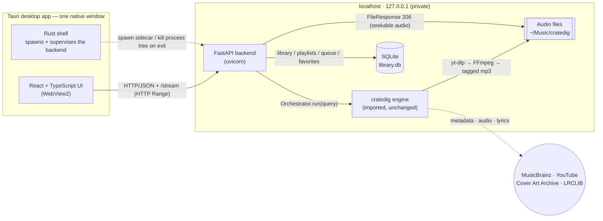

# cratedig-desktop

> A cross-platform (Windows-first) **desktop music app**: paste a MusicBrainz link or search
> `Artist - Title`, and it downloads the track, then manages and plays it like Spotify — library,
> player, playlists, favorites, queue, shuffle/repeat. A native desktop app (Tauri), not a web app.

A personal/portfolio project that wraps my existing
**[cratedig](https://github.com/pchrysostomou/cratedig)** download-and-tag engine in a real
desktop application with a Spotify-like UI.

## What it is

`cratedig-desktop` turns a one-line input — a **MusicBrainz** release/recording URL or MBID, or a
free-text `"Artist - Title"` search — into a tagged, playable track in a local music library:

1. **MusicBrainz** supplies clean metadata (title, artists, album, ISRC, cover art).
2. The **cratedig** engine finds the best-matching audio on **YouTube** (`yt-dlp`), transcodes it
   with **FFmpeg**, and embeds ID3 tags, cover art, and lyrics (LRCLIB).
3. The app stores it in a local **SQLite** library and plays it back with a full in-app player.

Everything runs locally on `127.0.0.1` — the UI never downloads or touches files directly; it talks
to a local backend that owns the engine, the database, and the audio.

## Architecture

The design is a strict separation of concerns — front-of-house (UI) ↔ kitchen (backend) ↔ the
appliance (the engine) — packaged into one native window by Tauri:



- **UI** never downloads, opens the database, or touches files — it only makes HTTP requests.
- **Backend** is the single owner of the engine, SQLite, and the audio files.
- **Rust shell** owns process lifecycle only: it starts the backend as a bundled **sidecar** on
  launch and kills its whole process tree on exit (no orphans, no leaked port).
- **cratedig stays UNCHANGED** — it is imported as a dependency, never modified or copied.

## Tech stack

| Layer | Choice |
|---|---|
| Desktop shell | **Tauri v2** (Rust + WebView2), packaged as an NSIS installer |
| UI | **React 18 + TypeScript + Vite** |
| Client state | **Zustand** (player/queue) · **TanStack Query** (server cache) |
| Audio | native **HTML5 `<audio>`** (HTTP Range streaming) |
| Drag-and-drop | **@dnd-kit** (playlist reorder) · **react-virtuoso** (virtualized library) |
| Backend | **FastAPI + uvicorn** (local, loopback-only) |
| Data | **SQLModel / SQLite** |
| Engine | **[cratedig](https://github.com/pchrysostomou/cratedig)** — MusicBrainz · yt-dlp · FFmpeg · Mutagen · LRCLIB |
| Packaging | **PyInstaller** (onedir sidecar) + Tauri bundler |

## Features

- **Add music** — paste a MusicBrainz release/recording URL or MBID, or search `Artist - Title`;
  downloads run as background jobs with live progress.
- **Library** — a virtualized grid with search-within-library (title / artist / any artist /
  album) and sortable columns.
- **Player** — native HTML5 audio with play/pause, seek, volume/mute, and "gapless-ish" next-track
  preloading; the seek bar is driven without per-tick re-renders.
- **Playlists** — create, rename, delete, add/remove tracks, and **drag-to-reorder**.
- **Favorites** — one-click heart on any track, with a dedicated Favorites view.
- **Queue + resume** — the queue, current track, **shuffle/repeat**, volume, and playhead position
  persist to the database, so playback **resumes where you left off** after a restart.
- **Delete from library** — with a confirmation dialog and an optional "also delete the file from
  disk" choice (default off).
- **Native + self-contained** — installs and runs as a desktop app; the backend auto-starts as a
  bundled sidecar (no Python or terminal required for end users).

## Development

Requires **Python 3.10+**, **Node 18+**, and — for the native shell — the **Rust** toolchain
(MSVC) + the **WebView2** runtime.

### Backend (FastAPI)

```powershell
cd backend
pip install -e ".[dev]"          # FastAPI + SQLModel + the cratedig engine (from GitHub)
uvicorn app.main:app --port 8008 # → http://127.0.0.1:8008/health
pytest                           # run the backend tests
```

> FFmpeg is required by the engine for downloads. The app uses a **system FFmpeg** if present and
> falls back to a bundled copy in packaged builds.

### Frontend (React + Vite)

```powershell
npm install
npm run dev      # → http://localhost:1420
npm test         # vitest
```

### Native app + installer (Tauri)

```powershell
npm run build:sidecar    # freeze the backend into the onedir sidecar
npm run tauri dev        # run the native window (backend auto-starts)
npm run tauri build      # produce the NSIS installer (…_x64-setup.exe)
```

> The packaged installer is currently **unsigned**, so Windows SmartScreen shows an
> "unknown publisher" prompt — choose *More info → Run anyway*. Code-signing is a future step.

## Legal & disclaimer

**Read this honestly — a disclaimer does not make anything legal.** This is a **personal,
educational** project.

`cratedig-desktop` reads only public **MusicBrainz** metadata (no DRM is bypassed) and downloads
the matching audio from **YouTube** via `yt-dlp`. Use it **only for content you have the right to
download** — public-domain or Creative Commons works, your own uploads, or material you may
lawfully copy for personal use. Downloading copyrighted audio **may violate YouTube's Terms of
Service and copyright law, which vary by jurisdiction**. **You are solely responsible for how you
use this software.** It is provided as-is, for lawful use, with no warranty.

## License

Free software under the **GNU General Public License v3.0 or later (GPL-3.0-or-later)**,
© Prodromos Chrysostomou — inherited from the `cratedig` engine it depends on. See
[`LICENSE`](LICENSE) and [`DESIGN.md`](DESIGN.md) for the full architecture and build plan.
